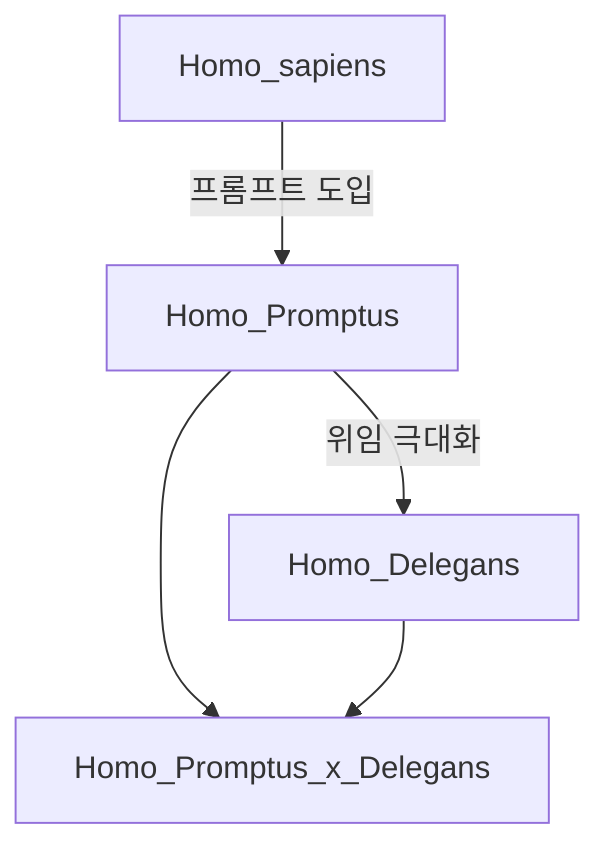

# 종 분류 (Species Taxonomy)

| 종 | 라틴어 | 특징 |
|----|--------|------|
| 현대인 | *Homo sapiens* | AI 이전 |
| 프롬프터 | *Homo Promptus* | 의도·맥락·검증 잔여 |
| 위임자 | *Homo Delegans* | 시키기·묻기·확인 생략 |
| 혼종 | *H. promptus × delegans* | 상황에 따라 모드 전환 |

## 진단 결과

종 진단 퀴즈는 5문항으로 Promptus / Delegans / hybrid 배지를 부여합니다.
